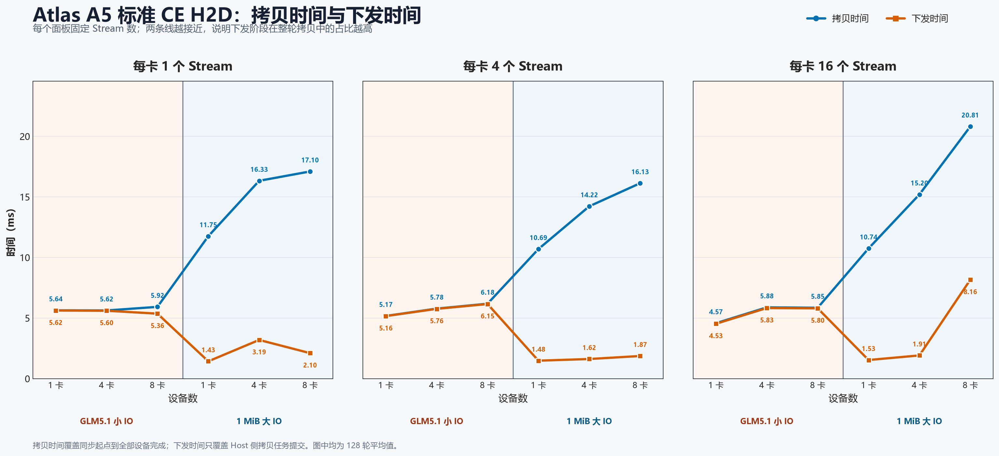
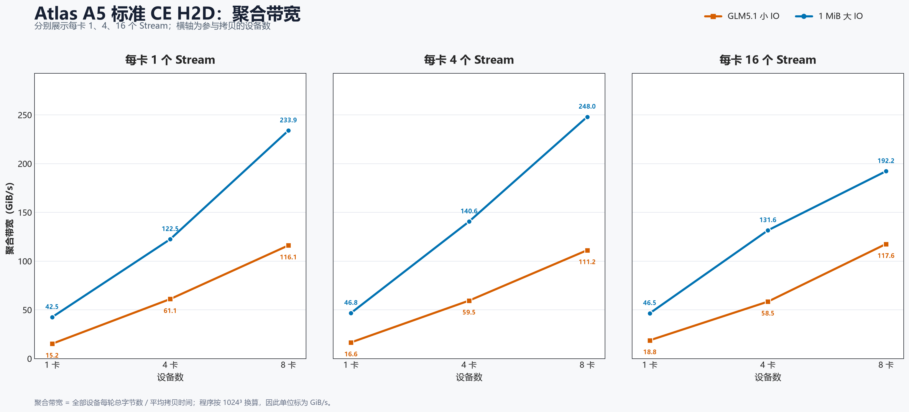
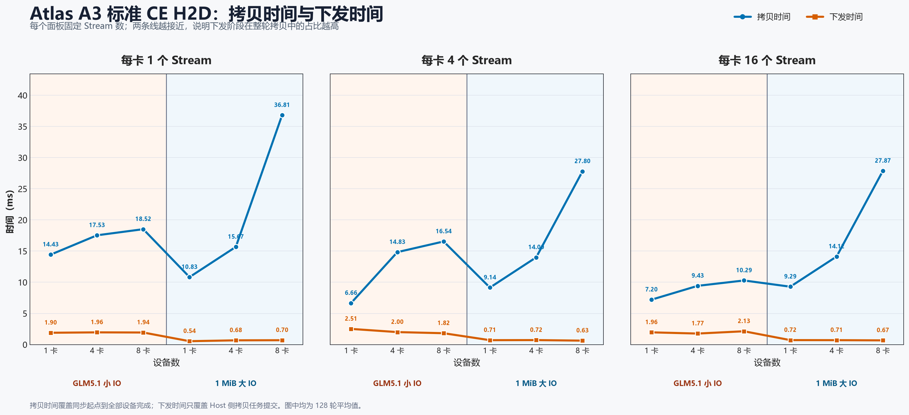
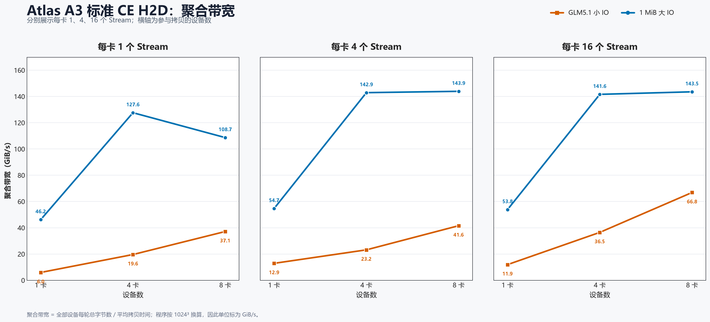
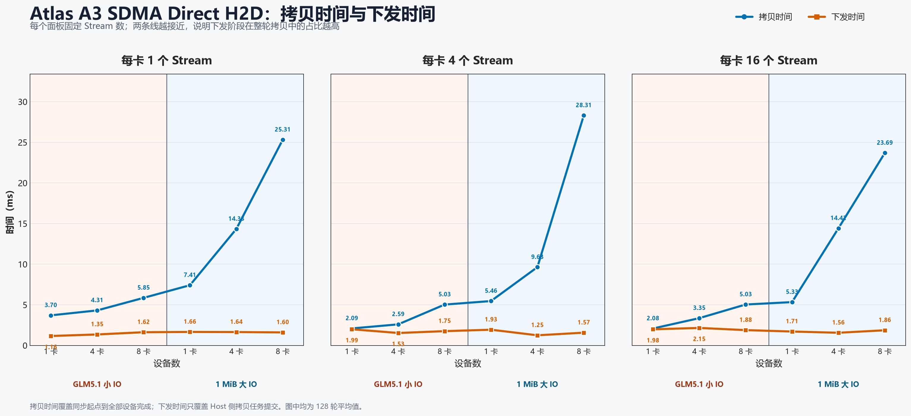
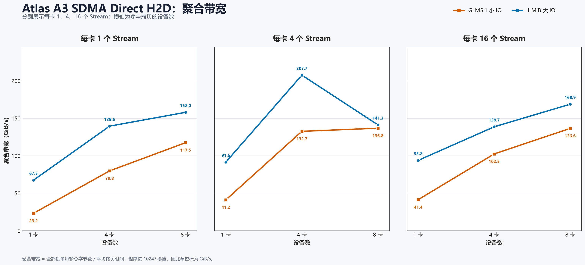

# Atlas A5/A3 All-Host H2D 拷贝性能对比

## 1. 测试配置

### 1.1 测试 Case

| 平台与方法 | Case | 运行标识 |
|---|---|---|
| Atlas A5 标准 CE | `all_host_to_all_device_ce_multi_stream` | `20260910_020859` |
| Atlas A3 标准 CE | `all_host_to_all_device_ce_multi_stream` | `20260912_095638` |
| Atlas A3 SDMA Direct | `all_host_to_all_device_ffts_direct_h2d` | `20260912_095638` |

- IO 模式：GLM5.1、1 MiB 大 IO。
- 卡数：1、4、8。
- 每卡 Streams：1、4、16。
- 固定参数：`-n 512 -i 128`。
- A3 SDMA 使用 `FFTS_MAX_READY_LANES=3`。

### 1.2 IO 规模

| IO 模式 | 每卡每轮数据量 | IO 描述数 | 标准 CE 下发次数 | SDMA Direct 下发次数 |
|---|---:|---:|---:|---:|
| GLM5.1 | 88 MiB | 1,536 | 1,536 | 512 |
| 1 MiB | 512 MiB | 512 | 512 | 512 |

GLM5.1 每个 block 包含 128 KiB、16 KiB、32 KiB 三段。标准 CE 分别下发三段，SDMA Direct 将三段组织成一个任务。

### 1.3 指标口径

- **下发时间**：`Submit Avg`。单卡为该卡自身统计值；多卡为各卡 `Submit Avg` 的算术平均。
- **拷贝时间**：`GroupWall Avg`。从同步起点到该轮全部设备进程完成，按 128 轮求平均。
- **聚合带宽**：全部设备每轮总字节数除以平均拷贝时间，单位为 GiB/s。

## 2. 可视化结果

### Atlas A5 标准 CE

#### 拷贝时间与下发时间

#### 聚合带宽

### Atlas A3 标准 CE

#### 拷贝时间与下发时间

#### 聚合带宽

### Atlas A3 SDMA Direct

#### 拷贝时间与下发时间

#### 聚合带宽

## 3. 测试数据

### 3.1 结果汇总

| 平台与方法 | IO 模式 | 下发时间范围（ms） | 拷贝时间范围（ms） | 下发时间占比 | 峰值带宽（GiB/s） | 峰值配置 |
|---|---|---:|---:|---:|---:|---|
| Atlas A5 标准 CE | glm5.1 | 4.53–6.15 | 4.57–6.18 | 90.5–99.7% | 117.582 | 8 卡 / 16 Streams |
| Atlas A5 标准 CE | 1m | 1.43–8.16 | 10.69–20.81 | 11.4–39.2% | 248.016 | 8 卡 / 4 Streams |
| Atlas A3 标准 CE | glm5.1 | 1.77–2.51 | 6.66–18.52 | 10.5–37.8% | 66.845 | 8 卡 / 16 Streams |
| Atlas A3 标准 CE | 1m | 0.54–0.72 | 9.14–36.81 | 1.9–7.7% | 143.900 | 8 卡 / 4 Streams |
| Atlas A3 SDMA Direct | glm5.1 | 1.16–2.15 | 2.08–5.85 | 27.7–95.3% | 136.816 | 8 卡 / 4 Streams |
| Atlas A3 SDMA Direct | 1m | 1.25–1.93 | 5.33–28.31 | 5.5–35.4% | 207.684 | 4 卡 / 4 Streams |

### 3.2 A3 标准 CE 与 SDMA 对比

带宽单位为 GiB/s。

| IO | 卡数 | Streams | CE 下发（ms） | SDMA 下发（ms） | CE 拷贝（ms） | SDMA 拷贝（ms） | CE 带宽 | SDMA 带宽 |
|---|---:|---:|---:|---:|---:|---:|---:|---:|
| glm5.1 | 1 | 1 | 1.896 | 1.158 | 14.434 | 3.699 | 5.954 | 23.233 |
| glm5.1 | 1 | 4 | 2.514 | 1.989 | 6.659 | 2.088 | 12.905 | 41.158 |
| glm5.1 | 1 | 16 | 1.962 | 1.980 | 7.203 | 2.077 | 11.931 | 41.376 |
| glm5.1 | 4 | 1 | 1.959 | 1.347 | 17.534 | 4.307 | 19.605 | 79.812 |
| glm5.1 | 4 | 4 | 2.002 | 1.527 | 14.833 | 2.591 | 23.175 | 132.671 |
| glm5.1 | 4 | 16 | 1.767 | 2.150 | 9.425 | 3.355 | 36.472 | 102.459 |
| glm5.1 | 8 | 1 | 1.936 | 1.622 | 18.516 | 5.850 | 37.130 | 117.521 |
| glm5.1 | 8 | 4 | 1.822 | 1.753 | 16.543 | 5.025 | 41.558 | 136.816 |
| glm5.1 | 8 | 16 | 2.135 | 1.882 | 10.285 | 5.033 | 66.845 | 136.598 |
| 1m | 1 | 1 | 0.543 | 1.658 | 10.827 | 7.409 | 46.181 | 67.485 |
| 1m | 1 | 4 | 0.706 | 1.932 | 9.144 | 5.459 | 54.681 | 91.592 |
| 1m | 1 | 16 | 0.716 | 1.707 | 9.287 | 5.328 | 53.839 | 93.844 |
| 1m | 4 | 1 | 0.681 | 1.642 | 15.673 | 14.331 | 127.608 | 139.558 |
| 1m | 4 | 4 | 0.719 | 1.245 | 13.997 | 9.630 | 142.888 | 207.684 |
| 1m | 4 | 16 | 0.707 | 1.556 | 14.125 | 14.417 | 141.593 | 138.725 |
| 1m | 8 | 1 | 0.699 | 1.601 | 36.813 | 25.310 | 108.657 | 158.040 |
| 1m | 8 | 4 | 0.630 | 1.566 | 27.797 | 28.306 | 143.900 | 141.313 |
| 1m | 8 | 16 | 0.674 | 1.863 | 27.869 | 23.686 | 143.529 | 168.876 |

### 3.3 完整数据

Atlas A5 标准 CE 完整 18 组结果

| IO | 卡数 | Streams | 下发 Avg/P90（us） | 拷贝 Avg/P90（us） | 带宽（GiB/s） |
|---|---:|---:|---:|---:|---:|
| glm5.1 | 1 | 1 | 5620/5660 | 5636/5676 | 15.248 |
| glm5.1 | 1 | 4 | 5159/5198 | 5173/5212 | 16.613 |
| glm5.1 | 1 | 16 | 4527/4796 | 4572/4847 | 18.796 |
| glm5.1 | 4 | 1 | 5601/5609 | 5625/5628 | 61.111 |
| glm5.1 | 4 | 4 | 5758/5801 | 5777/5822 | 59.503 |
| glm5.1 | 4 | 16 | 5825/6034 | 5880/6081 | 58.461 |
| glm5.1 | 8 | 1 | 5362/6163 | 5922/6186 | 116.093 |
| glm5.1 | 8 | 4 | 6154/6410 | 6182/6450 | 111.210 |
| glm5.1 | 8 | 16 | 5801/6019 | 5847/6077 | 117.582 |
| 1m | 1 | 1 | 1428/1440 | 11753/11800 | 42.542 |
| 1m | 1 | 4 | 1480/1504 | 10692/10722 | 46.764 |
| 1m | 1 | 16 | 1534/1668 | 10744/10789 | 46.538 |
| 1m | 4 | 1 | 3191/3463 | 16327/17740 | 122.496 |
| 1m | 4 | 4 | 1617/1691 | 14224/15208 | 140.607 |
| 1m | 4 | 16 | 1914/2319 | 15200/16940 | 131.579 |
| 1m | 8 | 1 | 2103/2393 | 17098/18747 | 233.945 |
| 1m | 8 | 4 | 1866/1921 | 16128/16852 | 248.016 |
| 1m | 8 | 16 | 8158/12077 | 20807/20869 | 192.243 |

Atlas A3 标准 CE 完整 18 组结果

| IO | 卡数 | Streams | 下发 Avg/P90（us） | 拷贝 Avg/P90（us） | 带宽（GiB/s） |
|---|---:|---:|---:|---:|---:|
| glm5.1 | 1 | 1 | 1896/2605 | 14434/15333 | 5.954 |
| glm5.1 | 1 | 4 | 2514/2630 | 6659/7165 | 12.905 |
| glm5.1 | 1 | 16 | 1962/2054 | 7203/8108 | 11.931 |
| glm5.1 | 4 | 1 | 1959/2279 | 17534/18347 | 19.605 |
| glm5.1 | 4 | 4 | 2002/2259 | 14833/9950 | 23.175 |
| glm5.1 | 4 | 16 | 1767/1869 | 9425/9296 | 36.472 |
| glm5.1 | 8 | 1 | 1936/2269 | 18516/19221 | 37.130 |
| glm5.1 | 8 | 4 | 1822/2029 | 16543/11247 | 41.558 |
| glm5.1 | 8 | 16 | 2135/2375 | 10285/9314 | 66.845 |
| 1m | 1 | 1 | 543/576 | 10827/10862 | 46.181 |
| 1m | 1 | 4 | 706/739 | 9144/9160 | 54.681 |
| 1m | 1 | 16 | 716/861 | 9287/9311 | 53.839 |
| 1m | 4 | 1 | 681/729 | 15673/15844 | 127.608 |
| 1m | 4 | 4 | 719/807 | 13997/14002 | 142.888 |
| 1m | 4 | 16 | 707/826 | 14125/14159 | 141.593 |
| 1m | 8 | 1 | 699/802 | 36813/36882 | 108.657 |
| 1m | 8 | 4 | 630/692 | 27797/27806 | 143.900 |
| 1m | 8 | 16 | 674/724 | 27869/27890 | 143.529 |

Atlas A3 SDMA Direct 完整 18 组结果

| IO | 卡数 | Streams | 下发 Avg/P90（us） | 拷贝 Avg/P90（us） | 带宽（GiB/s） |
|---|---:|---:|---:|---:|---:|
| glm5.1 | 1 | 1 | 1158/1197 | 3699/3721 | 23.233 |
| glm5.1 | 1 | 4 | 1989/2145 | 2088/2203 | 41.158 |
| glm5.1 | 1 | 16 | 1980/2104 | 2077/2188 | 41.376 |
| glm5.1 | 4 | 1 | 1347/1407 | 4307/4345 | 79.812 |
| glm5.1 | 4 | 4 | 1527/1884 | 2591/2708 | 132.671 |
| glm5.1 | 4 | 16 | 2150/2369 | 3355/3376 | 102.459 |
| glm5.1 | 8 | 1 | 1622/1739 | 5850/5863 | 117.521 |
| glm5.1 | 8 | 4 | 1753/1955 | 5025/5036 | 136.816 |
| glm5.1 | 8 | 16 | 1882/2183 | 5033/5061 | 136.598 |
| 1m | 1 | 1 | 1658/1774 | 7409/7418 | 67.485 |
| 1m | 1 | 4 | 1932/2495 | 5459/5518 | 91.592 |
| 1m | 1 | 16 | 1707/1996 | 5328/5407 | 93.844 |
| 1m | 4 | 1 | 1642/1778 | 14331/14349 | 139.558 |
| 1m | 4 | 4 | 1245/1397 | 9630/9658 | 207.684 |
| 1m | 4 | 16 | 1556/1875 | 14417/14421 | 138.725 |
| 1m | 8 | 1 | 1601/1863 | 25310/25372 | 158.040 |
| 1m | 8 | 4 | 1566/1797 | 28306/28321 | 141.313 |
| 1m | 8 | 16 | 1863/2134 | 23686/23707 | 168.876 |

原始数据：

- [`ascend_h2d_all_host_a5_ce_io_matrix_20260910.tsv`](data/ascend_h2d_all_host_a5_ce_io_matrix_20260910.tsv)
- [`ascend_h2d_all_host_a3_ce_io_matrix_20260912.tsv`](data/ascend_h2d_all_host_a3_ce_io_matrix_20260912.tsv)
- [`ascend_h2d_all_host_a3_sdma_io_matrix_20260912.tsv`](data/ascend_h2d_all_host_a3_sdma_io_matrix_20260912.tsv)

数据说明：

- “拷贝时间”是完整一轮的端到端时间，不等同于纯 DMA 时间。
- A5 `1 MiB / 8 卡 / 16 Streams` 的下发 Avg/P90 为 8.158/12.077 ms，是本批数据中的明显长尾点。
- A3 标准 CE 部分配置的拷贝 P90 低于 Avg，说明少量样本存在较长尾部。

## 4. 结论

### 4.1 带宽

- A5 标准 CE：GLM5.1 峰值 **117.582 GiB/s**，1 MiB 峰值 **248.016 GiB/s**。
- A3 标准 CE：GLM5.1 峰值 **66.845 GiB/s**，1 MiB 峰值 **143.900 GiB/s**。
- A3 SDMA Direct：GLM5.1 峰值 **136.816 GiB/s**，1 MiB 峰值 **207.684 GiB/s**。
- A3 的 GLM5.1 在全部配置中都是 SDMA 带宽更高；1 MiB 有 7/9 个配置是 SDMA 更高。

### 4.2 下发时间占比

- A5 标准 CE：GLM5.1 为 **90.5–99.7%**，1 MiB 为 **11.4–39.2%**。
- A3 标准 CE：GLM5.1 为 **10.5–37.8%**，1 MiB 为 **1.9–7.7%**。
- A3 SDMA Direct：GLM5.1 为 **27.7–95.3%**，1 MiB 为 **5.5–35.4%**。
- A5 的 GLM5.1 下发时间占比达到 **90.5%–99.7%**，说明这组小 IO 的拷贝时间基本由下发阶段决定。
