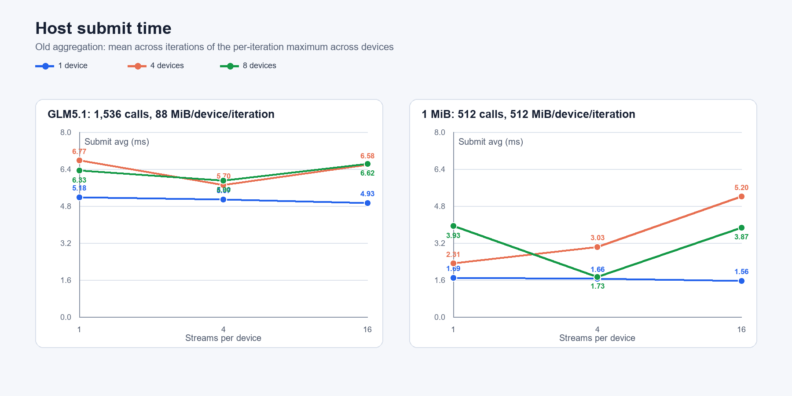
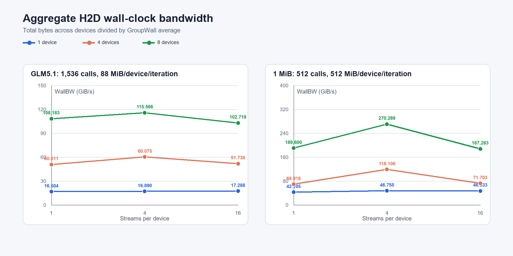

# Atlas A5 All-Host CE H2D IO 矩阵报告

## 1. 测试范围与统计口径

本报告整理运行标识 `20260909_100102` 的 18 组 Atlas A5 H2D 实测结果。所有 case 均执行成功，`exit_code=0`，且未开启 `COPY_ASCEND_PHASE_TRACE`。

- Case：`all_host_to_all_device_ce_multi_stream`
- IO 模式：`glm5.1`、1 MiB uniform IO
- Devices：1、4、8
- Streams：1、4、16
- 固定参数：`-n 512 -i 128 --submit-mode round-robin --process-sync barrier --stream-start-gate off --stream-sync stream`
- GLM5.1：每卡每轮 512 blocks，每 block 为 128 KiB + 16 KiB + 32 KiB，共 1,536 次 `aclrtMemcpyAsync`、88 MiB
- 1 MiB：每卡每轮 512 次 `aclrtMemcpyAsync`、512 MiB

### 1.1 Submit 口径

这批结果生成于 commit `8c1a12b` 修改跨卡汇总方式之前。多卡 `Submit Avg` 的计算方式是：

```text
第 i 轮合并值 = max(设备 0 第 i 轮 Submit, ..., 设备 N-1 第 i 轮 Submit)
Submit Avg     = 128 个“每轮最大值”的算术平均
Submit P90     = 128 个“每轮最大值”的 P90
```

单卡时没有跨卡合并，因此就是该卡自身 128 轮的 Submit Avg/P90。这里的 Submit 只覆盖 Host 调用异步拷贝 API 的下发阶段，API 返回不代表 H2D 已经完成。

### 1.2 墙钟带宽口径

本报告只采用 `WallBW` 判断带宽，不使用 device Event 带宽。`GroupWall` 和 `WallBW` 定义为：

```text
StartSkew = max(device_start) - min(device_start)
GroupWall = max(device_end)   - min(device_start)
WallBW    = 所有设备每轮总字节数 / GroupWall Avg
```

因此，WallBW 覆盖 barrier 释放后的 Host 侧起点偏差、异步提交、设备执行以及逐 stream 同步完成，是整个多卡 group 的端到端聚合墙钟带宽。运行程序和 TSV 列名写作 `GB/s`，但实现按 `1024^3` 换算，本报告统一标为 **GiB/s**。

## 2. 核心结论

1. **4 streams 是这组矩阵最稳定的选择。** 1 MiB 模式在 1、4、8 卡下的最佳 WallBW 都出现在 4 streams，分别为 **46.755、118.106、270.289 GiB/s**。GLM5.1 在 4、8 卡下也由 4 streams 最优，分别为 **60.075、115.566 GiB/s**；单卡 16 streams 的 **17.288 GiB/s** 只比 4 streams 高约 **2.4%**。

2. **16 streams 在多卡上出现回退。** 相比 4 streams，GLM5.1 的 4 卡和 8 卡 WallBW 分别变化 **-13.9%**、**-11.1%**；1 MiB 分别变化 **-39.3%**、**-30.7%**。当前数据能证明 16 streams 没有收益，但不能仅凭汇总表区分 CE 调度、Runtime 队列、Host 内存或拓扑中的具体限制。

3. **GLM5.1 的墙钟时间几乎全部落在 Submit 区间。** 各配置 `Submit Avg / GroupWall Avg` 为 **98.9%–99.7%**。每卡每轮需要发起 1,536 次小拷贝，设备执行又会与 Host 后续下发重叠，因此这说明下发路径和队列背压占据关键路径，不表示 `aclrtMemcpyAsync` 变成同步接口。

4. **1 MiB 模式呈现清晰的异步排队。** `Submit Avg / GroupWall Avg` 只有 **8.0%–18.6%**，大量时间位于提交结束之后的设备执行和 stream 同步阶段。最快 Submit 不必然对应最高带宽，例如 4 卡 1 stream 的 Submit 为 **2.310 ms**，低于 4 streams 的 **3.027 ms**，但 WallBW 只有 **68.918 GiB/s**，明显低于 4 streams 的 **118.106 GiB/s**。

5. **本轮峰值均来自 8 卡 4 streams。** GLM5.1 为 **115.566 GiB/s**，1 MiB 为 **270.289 GiB/s**。两种 IO 的单卡数据量和 API 次数不同，不能把二者的绝对带宽差直接归因于 IO 大小这一项。

## 3. Python 可视化

### 3.1 Host Submit Avg



纵轴是毫秒。多卡曲线使用本批旧口径，即每轮先取各卡 Submit 最大值，再对 128 轮求平均。

### 3.2 基于 GroupWall 的聚合带宽



纵轴是 GiB/s。每个点均使用所有设备总字节数除以对应的 `GroupWall Avg`。

## 4. 完整结果

| IO 模式 | 卡数 | Streams | Submit Avg / P90 (us) | GroupWall Avg / P90 (us) | WallBW (GiB/s) |
|---|---:|---:|---:|---:|---:|
| glm5.1 | 1 | 1 | 5179 / 5216 | 5207 / 5239 | 16.504 |
| glm5.1 | 1 | 4 | 5073 / 5104 | 5088 / 5118 | 16.890 |
| glm5.1 | 1 | 16 | 4927 / 5305 | 4971 / 5348 | 17.288 |
| glm5.1 | 4 | 1 | 6765 / 6821 | 6792 / 6833 | 50.611 |
| glm5.1 | 4 | 4 | 5699 / 5817 | 5722 / 5835 | 60.075 |
| glm5.1 | 4 | 16 | 6577 / 6747 | 6644 / 6809 | 51.738 |
| glm5.1 | 8 | 1 | 6333 / 6387 | 6355 / 6401 | 108.183 |
| glm5.1 | 8 | 4 | 5904 / 6026 | 5949 / 6045 | 115.566 |
| glm5.1 | 8 | 16 | 6621 / 6775 | 6693 / 6835 | 102.719 |
| 1m | 1 | 1 | 1686 / 1709 | 11875 / 11931 | 42.105 |
| 1m | 1 | 4 | 1657 / 1672 | 10694 / 10732 | 46.755 |
| 1m | 1 | 16 | 1557 / 1660 | 10745 / 10791 | 46.533 |
| 1m | 4 | 1 | 2310 / 2374 | 29020 / 29145 | 68.918 |
| 1m | 4 | 4 | 3027 / 5376 | 16934 / 19055 | 118.106 |
| 1m | 4 | 16 | 5201 / 6013 | 27893 / 28071 | 71.703 |
| 1m | 8 | 1 | 3931 / 5025 | 21097 / 21295 | 189.600 |
| 1m | 8 | 4 | 1727 / 1705 | 14799 / 15468 | 270.289 |
| 1m | 8 | 16 | 3866 / 4303 | 21358 / 21562 | 187.283 |

完整原始 TSV：[`docs/data/ascend_h2d_all_host_ce_io_matrix_20260909.tsv`](data/ascend_h2d_all_host_ce_io_matrix_20260909.tsv)。

## 5. 结果边界

- `--stream-sync stream` 不生成 device Event Copy 时间，因此本批结果不能拆出纯 DMA 时间；`GroupWall` 是端到端墙钟时间。
- StartSkew 的 P90 在全部多卡配置中均为 1 us，但少数组合出现 577–3290 us 的 Max。由于 WallBW 基于 GroupWall，这些罕见进程调度偏差已经进入端到端结果，没有被剔除。
- `1m / 8 卡 / 4 streams` 的 Submit Avg 为 1727 us，而 P90 为 1705 us。算术平均高于 P90 是允许的，表示最高 10% 内可能有长尾；当前 TSV 未保存 Submit Max，无法从 summary 精确还原长尾幅度。
- commit `8c1a12b` 已把后续多卡 Submit/Copy 输出改成“各卡同名统计值的平均”。新旧口径必须分开标注，不能直接把两批 Submit 数据拼接比较。
