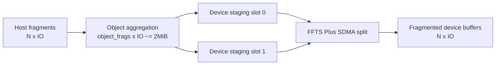
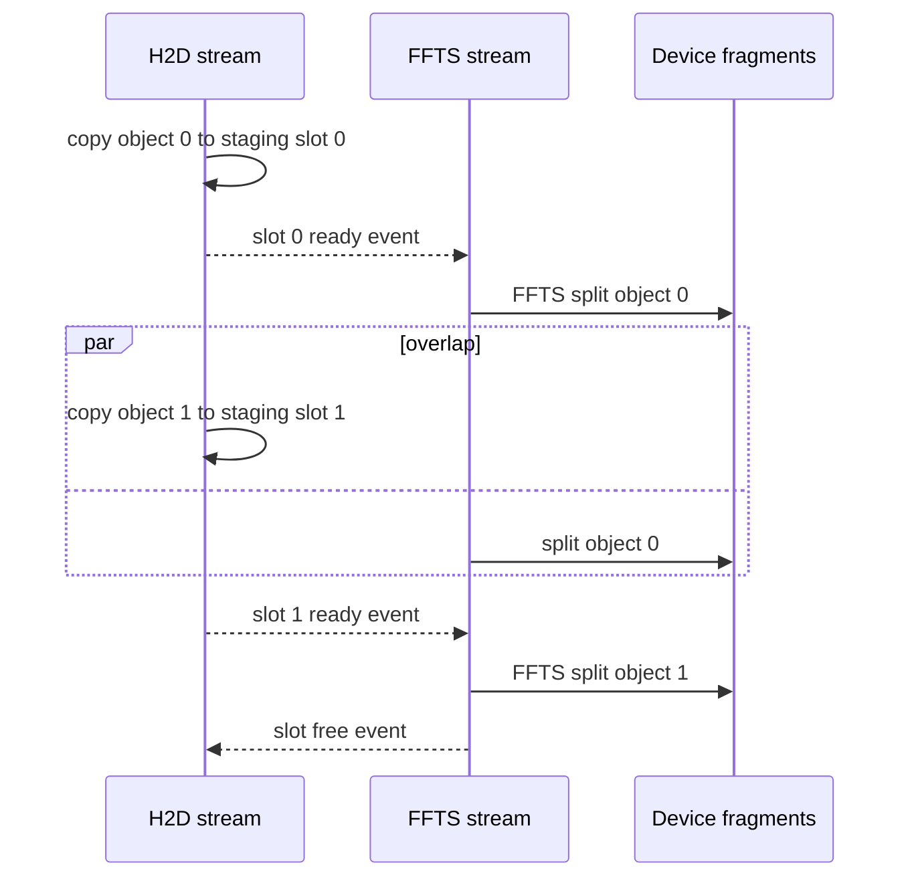

# H2D FFTS Pipeline 方案分享大纲

## 第一部分: 实验脚本方案

目标是用同一套 `copy` 可执行程序，在单卡上比较四条 H2D 路径:

- `ffts_2m_pipeline`: FFTS pipeline，按约 2MiB 聚合 logical object。
- `ffts_full_no_pipeline`: FFTS 全聚合，一个 batch 全部 IO 聚合成一个 logical object，不形成多 object pipeline。
- `ascend_ce_copy`: Ascend CE 单 stream H2D copy。
- `ascend_multistream_ce_copy`: Ascend CE multi-stream H2D copy。

脚本入口:

```bash
python3 scripts/run_h2d_ffts_pipeline_share_experiments.py
```

默认参数:

| 参数 | 默认值 | 含义 |
| --- | --- | --- |
| `--copy-bin` | `./build/module/copy/copy` | benchmark 可执行文件 |
| `--devices` | `1` | 单卡实验 |
| `--iterations` | `128` | 每个 case 的采样迭代次数 |
| `--exp1-sizes` | `2K 8K 37K 64K 128K 256K 512K` | 实验一的 IO size 扫描点 |
| `--exp1-count` | `1024` | 实验一固定 IO 数量 |
| `--exp2-size` | `37K` | 实验二固定 IO size |
| `--exp2-counts` | `10 16 32 64 128 256 512 1024` | 实验二的 IO 数量扫描点 |
| `--target-object-bytes` | `2097152` | 2MiB 聚合目标 |
| `--ffts-max-ready-lanes` | `8` | FFTS dispatcher ready lane 数 |

输出目录默认在 `logs/h2d_ffts_pipeline_share/<run-id>`，包含三类文件:

- `planned_commands.sh`: 本轮完整命令清单，可用于复现实验。
- `summary.tsv`: 机器可读的明细数据，后续可以直接导入画图工具。
- `report.md`: 可直接贴到分享材料里的实验数据表。

实验一: 扫 IO 大小。

| 维度 | 设置 |
| --- | --- |
| IO size | `2K 8K 37K 64K 128K 256K 512K` |
| IO count | `1024` |
| iterations | `128` |
| device count | `1` |
| 对比对象 | 四条 H2D 路径 |

实验二: 扫 IO 数量。

| 维度 | 设置 |
| --- | --- |
| IO size | `37K` |
| IO count | `10 16 32 64 128 256 512 1024` |
| iterations | `128` |
| device count | `1` |
| 对比对象 | 四条 H2D 路径 |

2MiB 聚合规则:

```text
object_frags = round(2MiB / io_size)
object_frags = min(max(object_frags, 1), io_count)
```

全聚合规则:

```text
object_frags = io_count
```

因此，`ffts_full_no_pipeline` 每轮只有一个 logical object；它仍复用同一个 FFTS case，但因为没有多个 object 交替进入双缓冲，所以可以作为“不 pipeline”的 FFTS 聚合基线。

## 第二部分: 方案讲解大纲

### 1. 背景和问题

小 IO H2D 的核心瓶颈不是单次 copy 能不能跑满，而是大量离散 IO 带来的提交次数、队列压力和设备侧调度碎片化。方案要回答三个问题:

- 能不能把多个小 IO 聚合成更适合 H2D 的大块传输。
- 聚合之后如何再拆回目标 device fragment。
- 聚合和拆分是否能流水化，避免 H2D 和 FFTS split 串行等待。

### 2. Baseline 对比关系

| 路径 | 意义 |
| --- | --- |
| Ascend CE copy | 最直接的一条 H2D baseline，观察逐 IO 提交成本和设备 copy 时间 |
| Ascend multi-stream CE copy | 观察多 stream 对小 IO 并发提交的收益和上限 |
| FFTS full aggregate no pipeline | 观察“只聚合、不流水”的收益，隔离聚合本身的效果 |
| FFTS 2M aggregate pipeline | 观察 2MiB object 粒度下，H2D staging 和 FFTS split overlap 后的收益 |

### 3. 方案结构示意图



### 4. Pipeline 时序



### 5. 实验一解读: IO size sweep

重点观察:

- 小 IO 区间: CE 单 stream 是否被提交开销压住，multi-stream 是否能缓解。
- 中等 IO 区间: 2MiB object 聚合是否能把 H2D 吞吐拉起来，同时保持 split 成本可控。
- 大 IO 区间: object frags 变少后，pipeline 深度下降，FFTS pipeline 和 full aggregate 的差距是否缩小。

注意点:

- `2K x 1024` 正好是 2MiB，2MiB pipeline 和 full aggregate 会落到同一个 object 粒度，预期差距很小。
- `512K` 时每个 2MiB object 只有 4 个 fragment，pipeline 的 object 数量减少，更适合看大 IO 下 FFTS split 的固定成本。

### 6. 实验二解读: IO count sweep

重点观察:

- IO 数量很少时，FFTS 聚合和 pipeline 是否被准备成本抵消。
- IO 数量增长到 64、128、256 之后，2MiB pipeline 是否开始稳定优于 CE 路径。
- IO 数量接近 1024 时，full aggregate 是否因为只有一个大 object 而缺少 overlap，2MiB pipeline 是否能继续保持带宽。

### 7. 分享时推荐图表

- 图一: 横轴 IO size，纵轴 BW(GB/s)，四条路径四条线。
- 图二: 横轴 IO count，纵轴 BW(GB/s)，四条路径四条线。
- 图三: 横轴 IO size，纵轴 Copy Avg(us)，用于解释带宽变化背后的时延。
- 图四: 横轴 IO count，纵轴 Submit Avg(us)，用于解释 host 提交开销。

### 8. 预期结论表达

如果实验结果符合预期，可以按下面逻辑组织结论:

1. 单 stream CE 是最直接 baseline，但面对大量小 IO 时提交和调度粒度偏细。
2. multi-stream CE 能缓解一部分并发问题，但本质仍是逐 fragment copy。
3. FFTS full aggregate 证明“先聚合再 split”可以减少 H2D 小 IO 压力，但缺少 H2D 和 split 的 overlap。
4. FFTS 2MiB aggregate pipeline 通过双缓冲 staging slot，把下一批 object 的 H2D 和上一批 object 的 FFTS split 重叠起来，是这套方案的关键收益来源。
