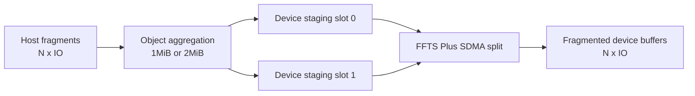
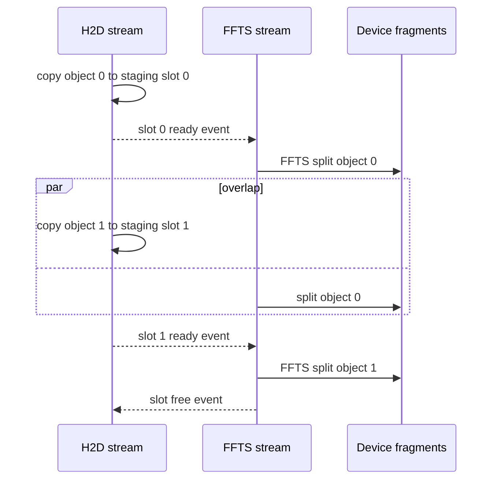
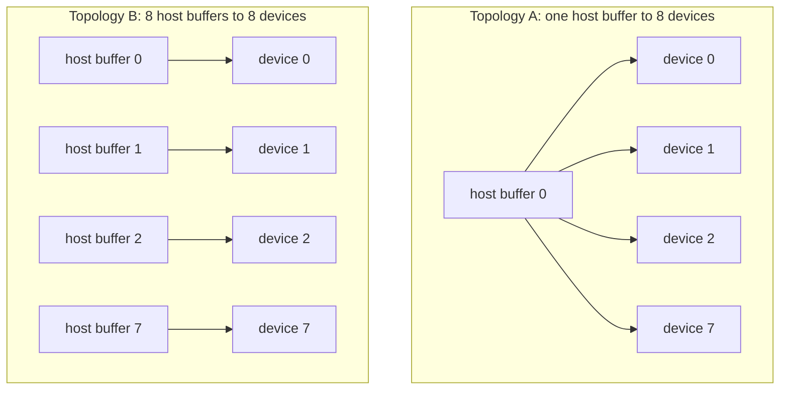

# H2D FFTS Pipeline 方案分享大纲

## 第一部分: 实验脚本方案

目标是用同一套 `copy` 可执行程序，把 H2D FFTS pipeline 的收益拆成三层来看:

- 单卡小 IO 下，FFTS 聚合 pipeline 相比 CE 和 multi-stream CE 是否有收益。
- 聚合 object 大小从 1MiB 到 2MiB 时，吞吐和时延是否敏感。
- 8 卡同时读一块 host buffer 和 8 块独立 host buffer 时，FFTS 聚合与 multi-stream CE 的差距。

脚本入口:

```bash
python3 scripts/run_h2d_ffts_pipeline_share_experiments.py
```

默认参数:

| 参数 | 默认值 | 含义 |
| --- | --- | --- |
| `--copy-bin` | `./build/module/copy/copy` | benchmark 可执行文件 |
| `--devices` | `1` | 实验一、实验二的单卡设备数 |
| `--iterations` | `128` | 每个 case 的采样迭代次数 |
| `--pipeline-targets` | `1M 2M` | FFTS pipeline 的 logical object 聚合目标 |
| `--exp1-sizes` | `2K 8K 32K 64K 128K 256K 512K` | 实验一的 IO size 扫描点 |
| `--exp1-count` | `1024` | 实验一固定 IO 数量 |
| `--exp2-size` | `32K` | 实验二固定 IO size |
| `--exp2-counts` | `10 16 32 64 128 256 512 1024` | 实验二的 IO 数量扫描点 |
| `--exp3-size` | `32K` | 实验三固定 IO size |
| `--exp3-count` | `1024` | 实验三固定 IO 数量 |
| `--exp3-devices` | `8` | 实验三多卡设备数 |
| `--ffts-max-ready-lanes` | `8` | FFTS dispatcher ready lane 数 |
| `--one-host-multistream-case` | `one_host_to_all_device_ce_multi_stream` | 实验三一块 host buffer 的 multi-stream CE 对照 |
| `--all-host-multistream-case` | `all_host_to_all_device_ce_multi_stream` | 实验三八块 host buffer 的 multi-stream CE 对照 |

输出目录默认在 `logs/h2d_ffts_pipeline_share/<run-id>`，包含三类文件:

- `planned_commands.sh`: 本轮完整命令清单，可用于复现实验。
- `summary.tsv`: 机器可读的明细数据，后续可以直接导入画图工具。
- `report.md`: 可直接贴到分享材料里的实验数据表。

实验一: 扫 IO 大小。

| 维度 | 设置 |
| --- | --- |
| IO size | `2K 8K 32K 64K 128K 256K 512K` |
| IO count | `1024` |
| iterations | `128` |
| device count | `1` |
| 对比对象 | FFTS 1MiB pipeline、FFTS 2MiB pipeline、FFTS 全聚合不 pipeline、Ascend CE、Ascend multi-stream CE |

实验二: 扫 IO 数量。

| 维度 | 设置 |
| --- | --- |
| IO size | `32K` |
| IO count | `10 16 32 64 128 256 512 1024` |
| iterations | `128` |
| device count | `1` |
| 对比对象 | FFTS 1MiB pipeline、FFTS 2MiB pipeline、FFTS 全聚合不 pipeline、Ascend CE、Ascend multi-stream CE |

实验三: 8 卡同时读拓扑。

| 维度 | 设置 |
| --- | --- |
| IO size | `32K` |
| IO count | `1024` |
| iterations | `128` |
| device count | `8` |
| 拓扑一 | `one_host_to_all_devices`: 8 卡同时读一块 host buffer |
| 拓扑二 | `all_hosts_to_all_devices`: 8 卡同时读 8 块独立 host buffer |
| 对比对象 | FFTS 1MiB pipeline、FFTS 2MiB pipeline、FFTS 全聚合不 pipeline、`one_host_to_all_device_ce_multi_stream`、`all_host_to_all_device_ce_multi_stream` |

聚合规则:

```text
object_frags = round(target_object_bytes / io_size)
object_frags = min(max(object_frags, 1), io_count)
```

全聚合规则:

```text
object_frags = io_count
```

因此，`ffts_full_no_pipeline` 每轮只有一个 logical object；它仍复用同一个 FFTS case，但因为没有多个 object 交替进入双缓冲，所以可以作为“不 pipeline”的 FFTS 聚合基线。

## 第二部分: 方案讲解大纲

### 1. 背景和问题

小 IO H2D 的核心瓶颈不是单次 copy 能不能跑满，而是大量离散 IO 带来的提交次数、队列压力和设备侧调度碎片化。方案要回答四个问题:

- 能不能把多个小 IO 聚合成更适合 H2D 的大块传输。
- 聚合之后如何再拆回目标 device fragment。
- 聚合和拆分是否能流水化，避免 H2D 和 FFTS split 串行等待。
- 单卡收益能否扩展到 8 卡同时读的实际拓扑。

### 2. Baseline 对比关系

| 路径 | 意义 |
| --- | --- |
| Ascend CE copy | 最直接的一条 H2D baseline，观察逐 IO 提交成本和设备 copy 时间 |
| Ascend multi-stream CE copy | 观察多 stream 对小 IO 并发提交的收益和上限 |
| FFTS full aggregate no pipeline | 观察“只聚合、不流水”的收益，隔离聚合本身的效果 |
| FFTS 1MiB aggregate pipeline | 观察更小 object 下的流水线粒度和 overlap 效果 |
| FFTS 2MiB aggregate pipeline | 观察更大 object 下的 H2D 吞吐、FFTS split 成本和 overlap 效果 |

### 3. 方案结构示意图



### 4. Pipeline 时序



### 5. 8 卡拓扑示意图



### 6. 实验一解读: IO size sweep

重点观察:

- 小 IO 区间: CE 单 stream 是否被提交开销压住，multi-stream 是否能缓解。
- 中等 IO 区间: 1MiB 和 2MiB object 哪个更容易形成稳定 overlap。
- 大 IO 区间: object frags 变少后，pipeline 深度下降，FFTS pipeline 和 full aggregate 的差距是否缩小。

注意点:

- `2K x 1024` 正好是 2MiB，2MiB pipeline 和 full aggregate 会落到同一个 object 粒度，预期差距很小。
- `32K x 1024` 是 32MiB，总体数据量足够大，同时 IO size 又比较常规，适合作为实验二和实验三的固定点。
- `512K` 时每个 2MiB object 只有 4 个 fragment，pipeline 的 object 数量减少，更适合看大 IO 下 FFTS split 的固定成本。

### 7. 实验二解读: IO count sweep

重点观察:

- IO 数量很少时，FFTS 聚合和 pipeline 是否被准备成本抵消。
- IO 数量增长到 64、128、256 之后，1MiB/2MiB pipeline 是否开始稳定优于 CE 路径。
- IO 数量接近 1024 时，full aggregate 是否因为只有一个大 object 而缺少 overlap，pipeline 是否能继续保持带宽。

### 8. 实验三解读: 8 卡同时读

重点观察:

- `one_host_to_all_devices` 下，一块 host buffer 被 8 卡同时读，适合观察 host 侧读压力和跨卡并发提交能力。
- `all_hosts_to_all_devices` 下，每张卡读自己的 host buffer，适合观察更理想的多卡独立数据源场景。
- multi-stream CE 仍然是逐 fragment copy；脚本会分别跑 `one_host_to_all_device_ce_multi_stream` 和 `all_host_to_all_device_ce_multi_stream`。
- 这两个 multi-stream CE case 使用按设备并行提交，避免 8 卡 x 多 stream 被主线程串行提交放大。
- FFTS pipeline 是每卡先聚合到 staging slot，再 split 到 device fragments。
- 如果 FFTS 在两种拓扑下都能保持优势，说明方案不是只对单卡局部场景有效。

### 9. 分享时推荐图表

- 图一: 横轴 IO size，纵轴 BW(GB/s)，展示实验一五条路径。
- 图二: 横轴 IO count，纵轴 BW(GB/s)，展示实验二五条路径。
- 图三: 横轴 IO size，纵轴 Copy Avg(us)，解释带宽变化背后的时延。
- 图四: 横轴 IO count，纵轴 Submit Avg(us)，解释 host 提交开销。
- 图五: 横轴 8 卡拓扑，纵轴 BW(GB/s)，展示 FFTS 聚合与 multi-stream CE 的多卡差异。

### 10. 预期结论表达

如果实验结果符合预期，可以按下面逻辑组织结论:

1. 单 stream CE 是最直接 baseline，但面对大量小 IO 时提交和调度粒度偏细。
2. multi-stream CE 能缓解一部分并发问题，但本质仍是逐 fragment copy。
3. FFTS full aggregate 证明“先聚合再 split”可以减少 H2D 小 IO 压力，但缺少 H2D 和 split 的 overlap。
4. FFTS 1MiB/2MiB aggregate pipeline 通过双缓冲 staging slot，把下一批 object 的 H2D 和上一批 object 的 FFTS split 重叠起来，是这套方案的关键收益来源。
5. 8 卡 one-buffer 和 eight-buffer 拓扑用于验证这个收益是否能进入真实多卡数据加载场景。
